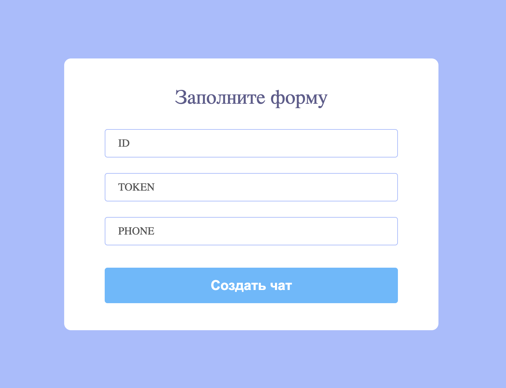
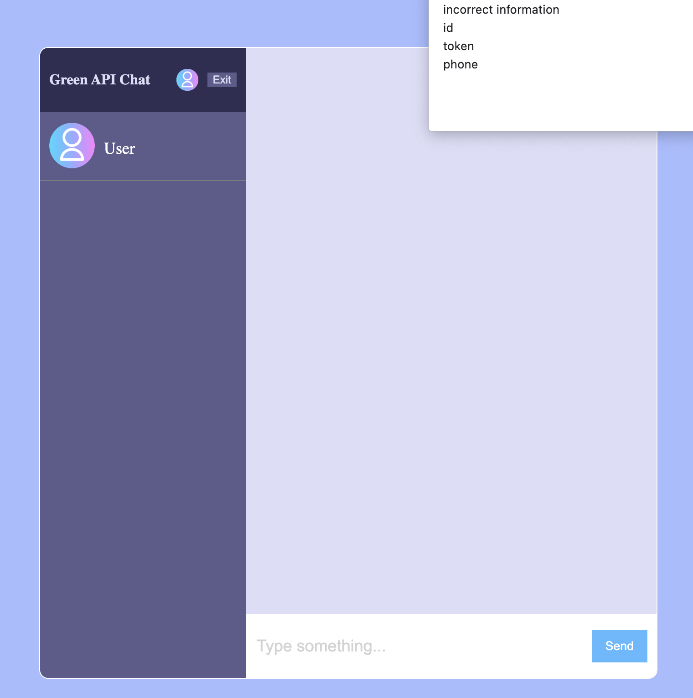

# green-api-chat
## Тестовое задание 

В рамках тестового задания требуется разработать пользовательский интерфейс для
отправки и получений сообщений WhatsApp

Требования:
1. Требуется разработать пользовательский интерфейс для отправки и получений
сообщений WhatsApp
2. Требуется использовать сервис GREEN-API 
    https://green-api.com/
3. Требуется реализовать отправку и получение только текстовых сообщений
4. Требуется за прототип интерфейса взять внешний вид чата
    https://web.whatsapp.com/
5. Требуется реализовать интерфейс максимально простым с минимальным набором
функций
6. Требуется отправку сообщений реализовать методом 
    https://green-api.com/docs/api/sending/SendMessage/
7. Требуется получение сообщений реализовать методом 
    https://green-api.com/docs/api/receiving/technology-http-api/
8. Требуется использовать технологию React

  Результат:
    • Пользователь переходит на сайт чата и вводит свои учетные данные из
      системы GREEN-API (idInstance, apiTokenInstance)
    • Пользователь вводит номер телефона получателя и создает новый чат
    • Пользователь пишет текстовое сообщение и отправляет его получателю в
      WhatsApp
    • Получатель отвечает на сообщение в мессенджере WhatsApp
    • Пользователь видит ответ получателя в чате

Для запуска приложения введите:
- npm install
- npm run dev

Так же можно попробовать по [ссылке](https://testshoplist.herokuapp.com/) .
